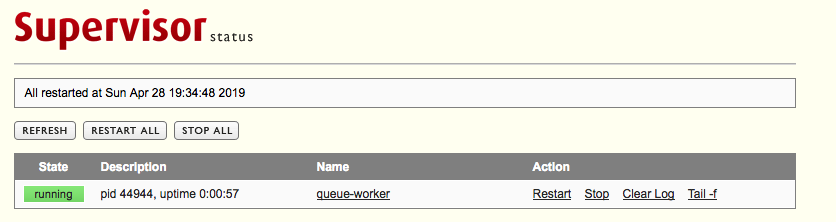

# Supervisor使用教程

这几天在研究怎么去控制队列消费进程的监控，看到了supervisor,就搞了起来，东西挺多的，就特意记录下来，为以后使用的时候，方便快速的查看。


## 概述

supervisor是一个进程管理工具，刚工作就接触到了，不过当时因为被脚本封装好了，所以都是直接用，对它的理解也仅仅是知道了有这么一个东西， 想着有机会了再深入了解。

supervisor是一个用python写的进程管理工具，可以很方便的用来启动、重启、关闭进程。除了对单个进程的控制，还可以同时启动、关闭多个进程，比如很不幸的服务器出问题导致所有应用程序都被杀死，此时可以用  supervisor 同时启动所有应用程序而不是一个一个地敲命令启动。


## 安装

一种是直接使用yum命令安装，这种安装的好处是安装后不用设置链接，直接就能使用命令。

```shell
$ yum install supervisor
```

第二种是使用python的`pip`工具安装，然后手动创建软链接。

```shell
$ pip install supervisor
# 安装后程序的二进制文件会存在python安装目录下的bin目录 
$ cd /usr/local/python27/bin
# 创建软链接
$ ln -s /usr/local/python27/bin/supervisorctl /usr/bin/supervisorctl
$ ln -s /usr/local/python27/bin/supervisord /usr/bin/supervisord
```


## 相关运行命令说明

`supervisor`包含三大部分：`supervisord` `supervisorctl` 和我们的应用程序，`supervisord`是服务端，`supervistorctl` 是客户端。

在命令行输入`supervisord`即可运行服务端，通常会加上`-c`选项来指定配置文件目录，服务端开启后使用`supervisorctl`控制客户端，用法如下：

```shell
> status # 查看程序状态
> stop ** # 关闭程序
> start ** # 启动程序
> restart ** # 重启程序
> reload # 重启服务器
> update # 更新配置文件
```


## 服务端配置

先通过echo_supervisord_conf 命令生成默认配置文件,路径随你指定。

```shell
$ echo_supervisord_conf > /etc/supervisord.conf
```

查看配置文件，常用配置说明。

```shell
;supervisord.conf

[unix_http_server]
file=/tmp/supervisor.sock ; UNIX socket 文件，supervisorctl 会使用
;chmod=0700 ; socket 文件的 mode，默认是 0700
;chown=nobody:nogroup ; socket 文件的 owner，格式： uid:gid

;[inet_http_server] ; HTTP 服务器，提供 web 管理界面
;port=127.0.0.1:9001 ; Web 管理后台运行的 IP 和端口，如果开放到公网，需要注意安全性
;username=user ; 登录管理后台的用户名
;password=123 ; 登录管理后台的密码

[supervisord]
logfile=/tmp/supervisord.log ; 日志文件，默认是 $CWD/supervisord.log
logfile_maxbytes=50MB ; 日志文件大小，超出会 rotate，默认 50MB
logfile_backups=10 ; 日志文件保留备份数量默认 10
loglevel=info ; 日志级别，默认 info，其它: debug,warn,trace
pidfile=/tmp/supervisord.pid ; pid 文件
nodaemon=false ; 是否在前台启动，默认是 false，即以 daemon 的方式启动
minfds=1024 ; 可以打开的文件描述符的最小值，默认 1024
minprocs=200 ; 可以打开的进程数的最小值，默认 200

; the below section must remain in the config file for RPC
; (supervisorctl/web interface) to work, additional interfaces may be
; added by defining them in separate rpcinterface: sections
[rpcinterface:supervisor]
supervisor.rpcinterface_factory = supervisor.rpcinterface:make_main_rpcinterface

[supervisorctl]
serverurl=unix:///tmp/supervisor.sock ; 通过 UNIX socket 连接 supervisord，路径与 unix_http_server 部分的 file 一致
;serverurl=http://127.0.0.1:9001 ; 通过 HTTP 的方式连接 supervisord

; 包含其他的配置文件
[include]
files = relative/directory/*.ini ; 可以是 *.conf 或 *.ini
```

通过 supervisord -c 来读取配置:

```shell
supervisord -c /etc/supervisord.conf
```

程序进程配置，主要是修改配置文件的`program`配置的内容，建议在`/etc`目录下新建一个目录`supervisor`来存放每个进程的配置文件，一个进程程序一个配置文件，修改`supervisord.conf`如下配置来包含程序配置文件：

```shell
[include]
files = /etc/supervisor/*.conf
```


## 进程客户端子进程配置

因为我要做的东西是监控队列消费者进程，所以这里我以此为例，进程配置说明如下：

```shell
[program:queue-worker]  # 程序的名称
directory = ~/machines/docker # 进程目录
command = docker-compose exec php-fpm /bin/bash -c 'cd capital && ./yii task/consume capital-default-queue'; 启动命令
autostart = true     ; 随supervisord的启动自动启动
startsecs = 5        ; 启动 5 秒后没有异常退出，就当作已经正常启动了
autorestart = true   ; 程序异常退出后自动重启
startretries = 3     ; 启动失败自动重试次数，默认是 3
user = binkzhao          ; 启动的用户身份
numprocs=2 ;表示运行2个queue-worker进程
; stdout 日志文件，需要注意当指定目录不存在时无法正常启动，所以需要手动创建目录（supervisord 会自动创建日志文件）
stdout_logfile = ~/logs/queues/log.log
stdout_logfile_maxbytes = 20MB  ; stdout 日志文件大小，默认 50MB
stdout_logfile_backups = 20     ; stdout 日志文件备份数

redirect_stderr = true ; 把 stderr 重定向到 stdout，默认 false
stderr_logfile=~/logs/err.log
stderr_logfile_maxbytes=10MB
stderr_logfile_backups=10

; 可以通过 environment 来添加需要的环境变量，一种常见的用法是修改 PYTHONPATH
; environment=PYTHONPATH=$PYTHONPATH:/path/to/somewhere
```

其中`numprocs`表示可以同时运行多少个worker,设置为2，表示启动2个worker进程;`program:queue-worker`中的`queue-worker`是该配置程序的名称，在使用`supervisorctl`管理进程的时候，可以用到，配置好程序配置后，需要加载配置才会生效：

```shell
$ supervisorctl reread
```

`supervisorctl`控制该进程的其他命令如下：

```shell
$ supervisorctl status
$ supervisorctl stop usercenter
$ supervisorctl start usercenter
$ supervisorctl restart usercenter
$ supervisorctl reread
$ supervisorctl update
```


## supervisorctl Web界面

一、自带的Web UI界面：

通过开启配置文件`supervisord.conf`如下配置：

```shell
[inet_http_server] ; HTTP 服务器，提供 web 管理界面
port=127.0.0.1:9001 ; Web 管理后台运行的 IP 和端口，如果开放到公网，需要注意安全性
username=user ; 登录管理后台的用户名
password=123 ; 登录管理后台的密码
```

配置好后，重新启动`supervisor`，浏览器打开访问：`127.0.0.1:9001`



这个不能跨机器管理，如果想跨机器管理，可以去安装CeSi管理软件：https://github.com/Gamegos/cesi